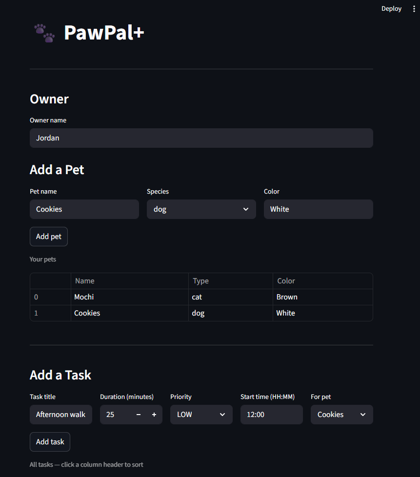

# PawPal+ (Module 2 Project)

You are building **PawPal+**, a Streamlit app that helps a pet owner plan care tasks for their pet.

## 📸 Demo

<a href="PawPal+.png" target="_blank"></a>

## Scenario

A busy pet owner needs help staying consistent with pet care. They want an assistant that can:

- Track pet care tasks (walks, feeding, meds, enrichment, grooming, etc.)
- Consider constraints (time available, priority, owner preferences)
- Produce a daily plan and explain why it chose that plan

Your job is to design the system first (UML), then implement the logic in Python, then connect it to the Streamlit UI.

## What you will build

Your final app should:

- Let a user enter basic owner + pet info
- Let a user add/edit tasks (duration + priority at minimum)
- Generate a daily schedule/plan based on constraints and priorities
- Display the plan clearly (and ideally explain the reasoning)
- Include tests for the most important scheduling behaviors

## Features

| Feature | Description |
|---|---|
| **Chronological sorting** | `Scheduler.sort_by_time()` orders all pending tasks by `start_time` (HH:MM) so the day's plan reads top-to-bottom in time order. |
| **Priority-based scheduling** | `generate_daily_schedule()` ranks tasks by priority (HIGH → MEDIUM → LOW) before feeding them to other scheduler methods. |
| **Overlap conflict detection** | `detect_conflicts()` compares every pair of pending tasks using interval arithmetic (`A.start < B.end AND B.start < A.end`). Back-to-back tasks with zero gap are not false-positives. Works across all pets. |
| **Daily & weekly recurrence** | Marking a `daily` or `weekly` task done via `complete_task()` automatically calls `next_occurrence()`, which creates a copy with `completed=False` and a `due_date` advanced by 1 day or 7 days respectively. One-off (`once`) tasks produce no follow-up. |
| **Task filtering** | `filter_tasks(completed, pet_name)` lets callers narrow the task list by completion status, by pet, or both — useful for per-pet views and reporting. |
| **Pending time summary** | `total_time_minutes()` sums `duration_minutes` across all pending tasks so the owner can see how much care time remains in the day. |
| **Multi-pet support** | Tasks are stored per `Pet` and aggregated through `Owner.all_tasks`. Conflicts are detected across pets as well as within the same pet. |
| **In-app "Done" buttons** | The Streamlit UI renders a Done button for each scheduled task; clicking it calls `complete_task()` and reruns the page so recurrence and metrics update instantly. |

## Getting started

### Setup

```bash
python -m venv .venv
source .venv/bin/activate  # Windows: .venv\Scripts\activate
pip install -r requirements.txt
```

### Suggested workflow

1. Read the scenario carefully and identify requirements and edge cases.
2. Draft a UML diagram (classes, attributes, methods, relationships).
3. Convert UML into Python class stubs (no logic yet).
4. Implement scheduling logic in small increments.
5. Add tests to verify key behaviors.
6. Connect your logic to the Streamlit UI in `app.py`.
7. Refine UML so it matches what you actually built.

## Testing PawPal+

### Run the tests

```bash
python -m pytest
```

To run a single test file:

```bash
python -m pytest tests/test_pawpal.py -v
```

### What the tests cover

| Area | Tests |
|---|---|
| **Sorting** | Verifies `sort_by_time` returns tasks in chronological order regardless of insertion order; also confirms completed tasks are excluded from results |
| **Recurrence** | Confirms that completing a `daily` task automatically creates a follow-up task due the next day with `completed=False`; confirms that completing a `once` task creates no follow-up |
| **Conflict detection** | Verifies overlapping time windows are flagged as conflicts; checks that back-to-back tasks (zero gap, no overlap) are not false-positives; confirms completed tasks are excluded from conflict checks |

### Confidence Level

★★★★☆ (4/5)

The core scheduling behaviors — sorting, recurrence, and conflict detection — are well covered and all 9 tests pass. The one gap keeping this from a 5 is that edge cases around `due_date=None` in `next_occurrence` and tasks that span midnight are not yet tested, so behavior in those scenarios relies on code inspection rather than verified test outcomes.